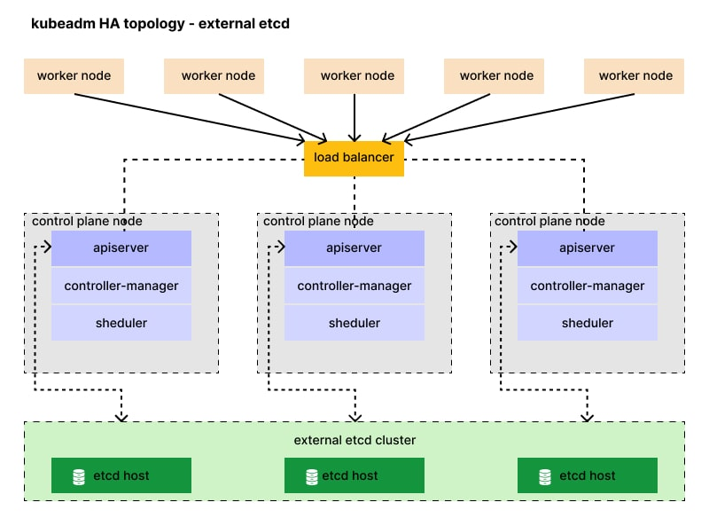

# 🚀 ansible-k8s

Ansible playbooks to deploy a **Kubernetes cluster** on **Debian 12**.

---

## 📋 Versions

- **Ansible**: `>= 2.10.8`
- **[Kubernetes](https://kubernetes.io/releases/)**: `v1.34`
- **[ETCD](https://github.com/etcd-io/etcd/)**: `v3.6.5`
- **[containerd](https://github.com/githubixx/ansible-role-containerd/releases/)**: `v2.1.3`
- **[Cilium (CNI)](https://github.com/cilium/cilium)** : `1.18.2`


## ✅ Prerequisites

### 📦 1. Install Required Ansible Roles

Install the necessary roles listed in the `requirements.yml` file:

```bash
ansible-galaxy install -r requirements.yml
```

### 📝 2. Update the Inventory
Make sure to update the inventory and shared variables:

* **Inventory file**:
[inventory/hosts](./inventory/hosts)

* **Global variables** (shared across roles):
[inventory/group_vars/all.yml](./inventory/group_vars/all.yml)

### 🔗 3. Test SSH Connectivity

Verify SSH access to all hosts in your inventory:

```bash
ansible -i inventory/ -m ping all --user=<sudo-user> --become
```

---

## Playbooks

### iptables-config.yml

This playbook install iptables and apply the rules on all nodes related to kubernetes cluster `k8s`.
Due to some automatic iptable-rules installation by kubelet/containerd **firewalld** should not be used in parallel.

```bash
ansible-playbook -i inventory/ --user=<sudo-user> --become ./iptables-config.yml
```

### 🧰 provision-nodes.yml

Installs all required dependencies on the cluster nodes, including the HAProxy-based kube-apiserver load balancer.

```bash
ansible-playbook -i inventory/ --user=<sudo-user> --become ./provision-nodes.yml
```

### 🧠 `multi-master-etcd.yml`

Bootstraps the Kubernetes control plane using an **external ETCD cluster**.

This playbook performs:

- Initializes the **first master node** with external ETCD
- Joins **additional master nodes** using external ETCD
- Joins **worker nodes**
- Installs the **CNI plugin**

**Run the playbook:**

```bash
ansible-playbook -i inventory/ --user=<sudo-user> --become ./multi-master-etcd.yml
```

## Extra

## Tainting and Labeling VICE Worker Nodes
Once you have your nodes joined the cluster:

The CyVerse Discovery Environment uses taints and labels to ensure that some nodes are used exclusively for VICE
analyses. To mark a node as a VICE worker node, run this command on any node that has access to the Kubernetes API:

**Run this command to label node**
```bash
kubectl label nodes <VICE-WORKER-NODES> vice=true
```

**To prevent non-VICE pods from running on a node, run this command:**
```bash
kubectl taint nodes <VICE-WORKER-NODES> vice=only:NoSchedule

# if you want to remove the taint run this command
kubectl taint nodes <VICE-WORKER-NODES> vice=only:NoSchedule-
```

**check if labeld**
```bash
kubectl get nodes -l vice=true
```

## COPY kubeconfig to your local machine
```bash
# this will allow you to access your cluster from your local machine.
scp root@<MASTER_NODE>:/etc/kubernetes/admin.conf ~/.kube/config
```


**WARNING**
Destroy the kubernetes cluster.

```bash
ansible-playbook -i inventory/ destroy.yml --user root
```

---

# Loadbalancers

This ansible repository also have playbooks that will generate and install HAProxy.

**Note:** All HAProxy nodes is a **Debian 12** based.

#### Install the vice HAproxy

```bash
ansible-playbook -i inventory/ --user=<sudo-user> --become ./vice-haproxy-install.yaml
```

#### Install the (HAproxy01) loadbalancer

```bash
ansible-playbook -i inventory/ --user=<sudo-user> --become ./haproxy01.yml
```

#### Install the (HAproxy02) loadbalancer

```bash
ansible-playbook -i inventory/ --user=<sudo-user> --become ./haproxy02.yml
```

#### Install the loadbalancer for k8s ingress
```bash
ansible-playbook -i inventory/ --user=<sudo-user> --become ./lb-haproxy-install.yaml
```

# Install & create ssl certificates

For more documentation see the [README](roles/cert_bot/README.md) 

```bash
ansible-playbook -i inventory/ --user=<sudo-user> --become ./cert_bot.yaml
```

This playbook has an additional variable `var_hosts`. Default ist `'~.*-vice-haproxy\\..*'`. Change this var to the host or group the playbook should run on.


```bash
ansible-playbook -i inventory/ --user=<sudo-user> --extra-vars="var_hosts=loadbalancer" --become ./cert_bot.yaml
```

# External ETCD cluster
[Official Repo](https://github.com/etcd-io/etcd/)




# ETCD external etcd for kubernetes

make sure your inventory has the group `etcd-nodes`, e.g.
```conf
[etcd-nodes]
etcd-c01
etcd-c02
etcd-c03
```

## Ports
**Ports** that need to be opened and allowed for the etcd cluster.

| Port | Protocol | Purpose |
|------|----------|---------|
| 2379 | TCP | Main client communication — used by Kubernetes API server to talk to etcd |
| 2380 | TCP | Peer communication between etcd cluster members |

### etcd.yml
The first step is to configure and get the ETCD cluster up and running.
once the ETCD cluster is configured we could join the kubernetes cluster to it.


This playbook will do the followings:

* Generate selfsigned certs for etcd cluster, [README](./roles/etcd_certificates/README.md)
* Deploy ETCD cluster, [README](./roles/external-etcd/README.md)

```bash
ansible-playbook -i inventory/ --user=<sudo-user> --become ./etcd.yml
```


### Interact with ETCD cluster
After successfully deploying, you can check your etcd cluster information either from within your Kubernetes cluster or directly from the etcd cluster itself.

**Get ETCD info from kubernetes**
```bash
kubectl get pod -n kube-system -l component=kube-apiserver -o yaml | grep -i etcd
```

**Interact with ETCD cluster**
```bash
ssh USER@etcd-host

etcdctl version
```


# Containerd

```bash
# list containers
crictl --runtime-endpoint unix:///run/containerd/containerd.sock ps -a
```
