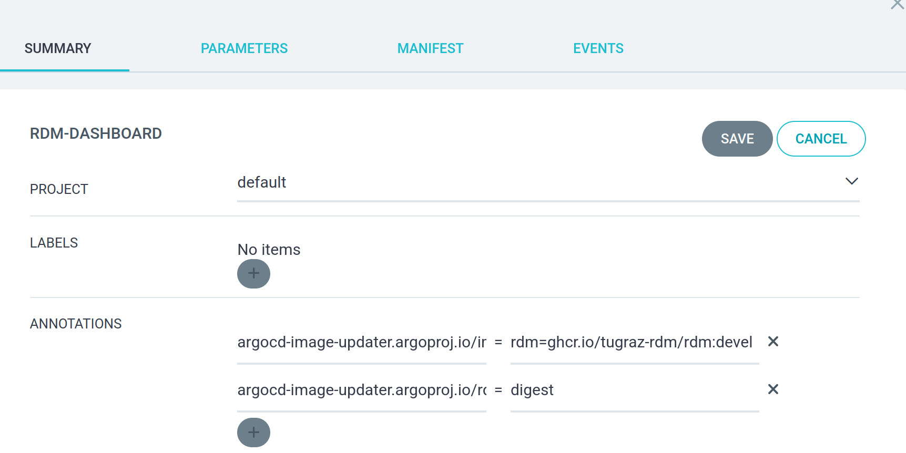

# ArgoCD Image Updater

## [argocd-image-updater](https://argocd-image-updater.readthedocs.io/en/stable/)

Enable automatic redeployments whenever a Docker image digest is updated by following these steps.

**Note:** This feature is **intended for development or testing purposes** and is **not recommended for production environments**.

Your application **must use a Kubernetes Deployment managed via Kustomize or Helm charts**; other deployment types are not supported.

### Install argocd-image-updater in argocd namespace

```
helm install argocd-image-updater argo/argocd-image-updater -n argocd --set config.argocd.serverAddress=argocd-server.argocd.svc.cluster.local
```

### Add argocd-image-updater annotations

**Manifest:**

```bash
kind: Application
metadata:
  name: app-name
  namespace: argocd
  annotations:
    argocd-image-updater.argoproj.io/image-list: "<your_app_name>=<registry>"
    argocd-image-updater.argoproj.io/<your_app_name>.update-strategy: digest
```

**ArgoCD UI:**
<div style="text-align: center;">

</div>

